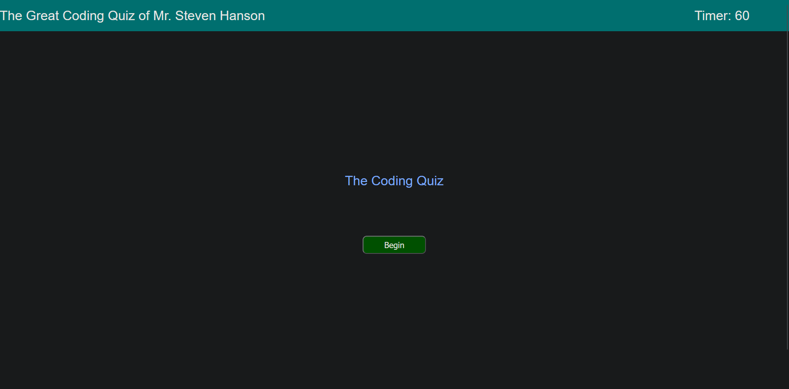
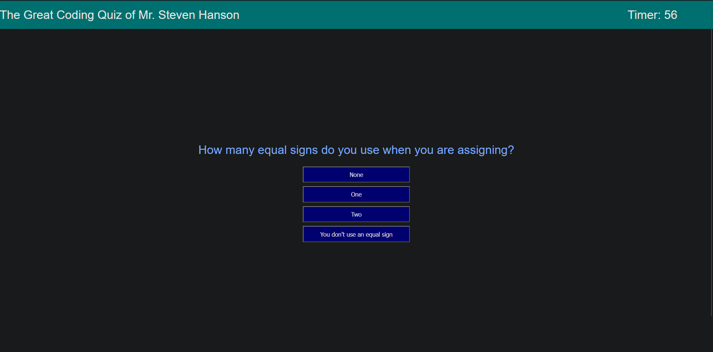
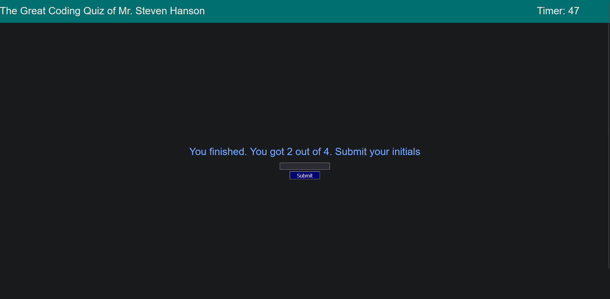
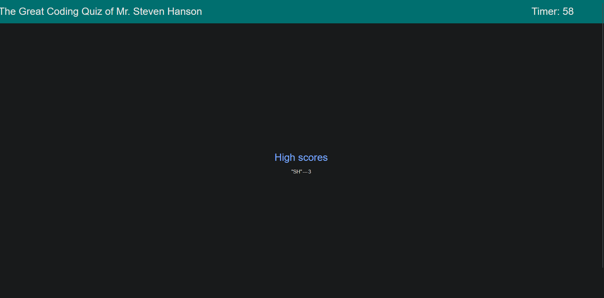
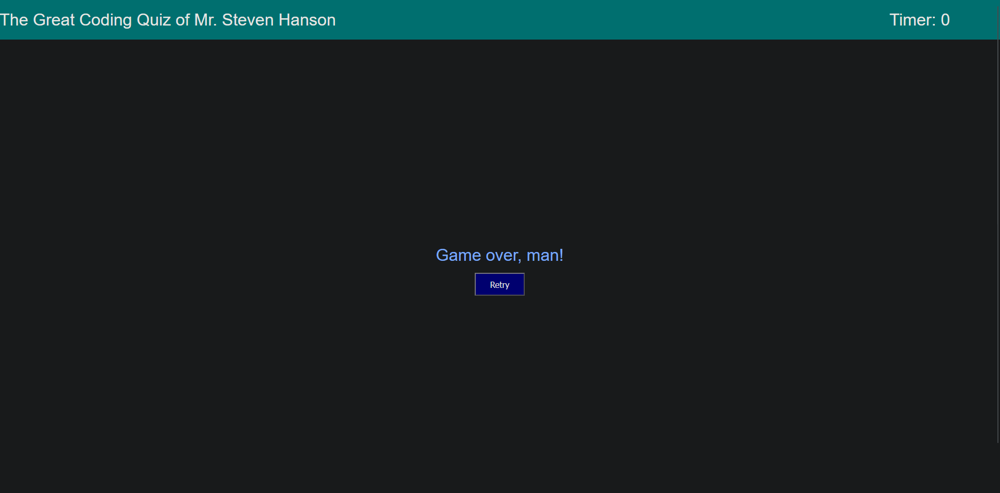

# 04 The Great Coding Quiz of Mr. Steven Hanson

## Description

Take a 4-question coding quiz. Your score is determined by how many you get right. If you run out of time, you get a game over. You can see your score at the end along with your initials.

High scores table is dysfunctional in that it doesn't save your score when you next visit, and it's formatted weirdly because I couldn't figure it out.

## Screenshots

## Link
[Coding Quiz]